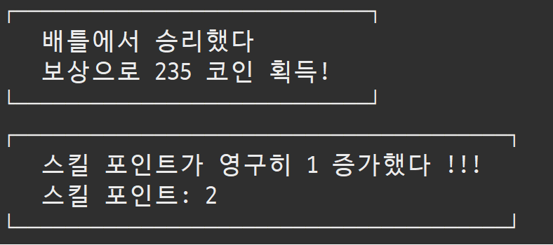

# BattleTime

> 게임 소개

**매일매일 함께하는 길드 전투**

 
 

> 게임 설명

▼ 길드 
- 전사, 마법사, 힐러 3명으로 구성된 길드입니다.
- 각 길드원은 공격력과 스킬 포인트를 가지고 있습니다.
  - 스킬
      - 전사: <<죽음의 일격>> 한 몬스터에게 공격력 2배의 피해를 입힙니다.
      - 마법사: <<마법의 태풍>> 모든 몬스터에게 공격력 1/2의 피해를 입힙니다.
      - 힐러: <<안정의 선율>> 길드원 모두가 각자의 최대체력의 30퍼를 회복합니다. 
 
▼ 몬스터 
- 박쥐, 오크, 트롤이라는 세 종류의 몬스터가 존재합니다.
 
 
▼ 본 게임은 다음과 같은 스테이지를 제공합니다 
┌────────┐ 
│ 🏠 아지트　│ 
│ 🏪 상점　　│ 
│ ⚔️ 전투　　│ 
│ 📜 저장　　│ 
│ 🔚 종료　　│ 
└────────┘ 
 

▼ 본 게임은 다음과 같은 기능을 제공합니다 
1. 🏠아지트 
    * 취침 
      * 모든 길드원의 체력과 스킬포인트가 회복됩니다.
      * 전투 패배 후 이용 시, 재전투가 가능합니다.
    * 지갑 
      * 보유 코인을 확인할 수 있습니다.
2. 🏪 상점
    * 매일 랜덤으로 0~2개의 물약이 들어옵니다.
    * 물약 1개당 200코인 입니다.
    * 길드가 보유하고 있는 코인 내에서 구매가 가능합니다.
3. ⚔️ 전투
    * 승리 기준, 하루에 1번 입장 가능합니다.
    * 랜덤 몬스터 4마리가 출현합니다.
    * 길드원이 순서대로 랜덤의 몬스터를 공격합니다.
    * 길드원은 본인 차례에 보유 스킬 포인트 내에서 스킬을 사용할 수 있습니다.
    * 승리
      * 0~300 코인을 획득합니다.
      * 10퍼센트의 확률로 스킬포인트가 영구적으로 1 증가합니다.
      * 몬스터의 체력과 공격력이 늘어납니다. (다음 배틀 때 더 강해진 몬스터를 만나게 됩니다)
    * 패배
      * 0-150 코인을 빼앗깁니다.
      * 아지트로 이동합니다. (취침으로 회복 시 재배틀 가능)
4. 📜 저장
    * 배틀 승리 후 저장 시에만 하루가 늘어납니다. (1번 제한으로 무분별한 날짜 늘리기 방지)
    * 저장하지 않고 종료 시, 해당 날짜의 게임 데이터는 사라집니다.
5. 🔚 종료
    * 종료 시, 친절하게 저장 여부를 묻습니다.
    * 저장하지 않고 종료 시, 해당 날짜의 게임 데이터는 사라집니다.

 

> Class Diagram (UML)

 
 
> Demo
## 1일차
**전투(전사, 마법사 스킬 사용), 상점, 저장**

 
 
## 2일차
**전투(포션 사용), 승리시 재전투 불가능 확인**

 
 
### ▼ 10퍼센트의 확률로 스킬포인트가 영구적으로 1 증가합니다.

 
 
## 패배 엔딩
**전투(힐러 스킬 사용), 취침**

